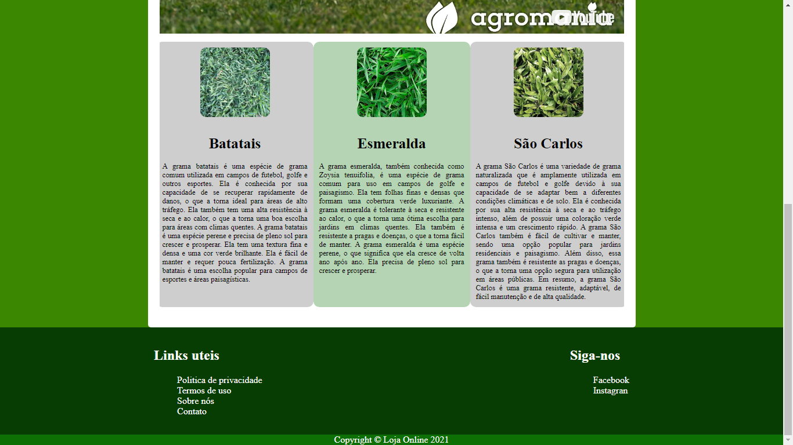
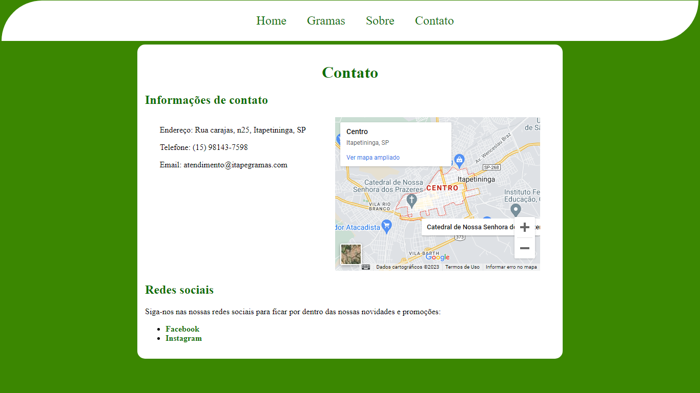

 
<h1>Pagina web para um Grameiro</h1>

 
 

        <h2>Introdução</h2>
        
Este projeto é um exemplo fictício de uma empresa especializada em comércio de gramas, com o objetivo de mostrar aos potenciais clientes as qualidades e vantagens das gramas. Além disso, este projeto foi criado com o objetivo de desenvolver minhas habilidades pessoais, especificamente, na prática de HTML e CSS.

 

 

        <h2>Como utilizar</h2>
        
Para acessar esse projeto, basta fazer o download da pasta de arquivos e abrir o arquivo "index.htm" no seu navegador.
 

 

 <h2>Apresentação</h2>
 
Algumas das telas da página 

            

                
                
                
            

            <video style="width: 800px;" src="readme/2023-01-21 14-02-20.mp4" autoplay controls="true"></video>
 

https://user-images.githubusercontent.com/77999161/213879831-d1890185-0cc9-4313-8ef2-60ec2f50c201.mp4

